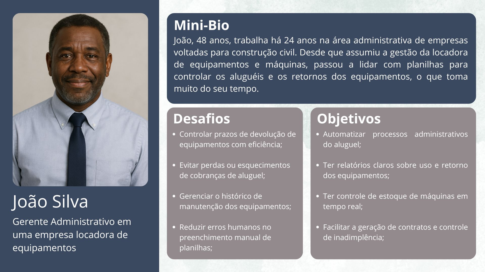
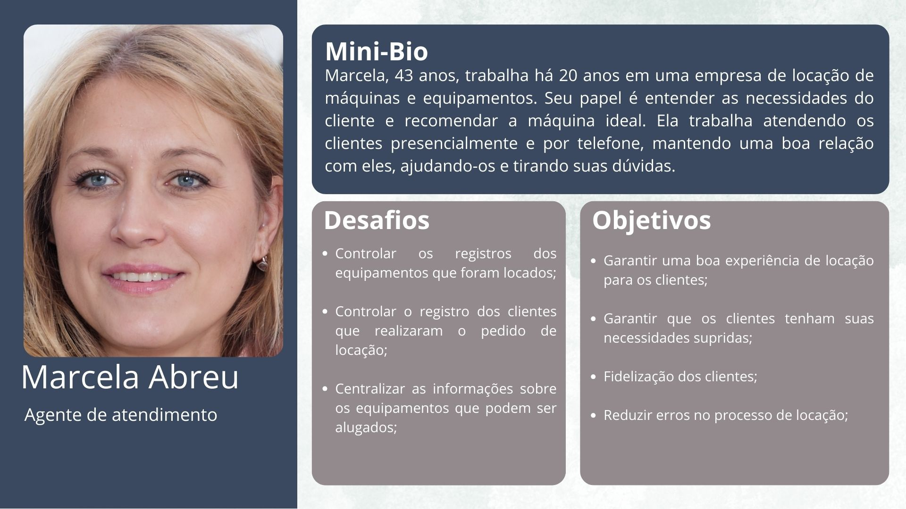
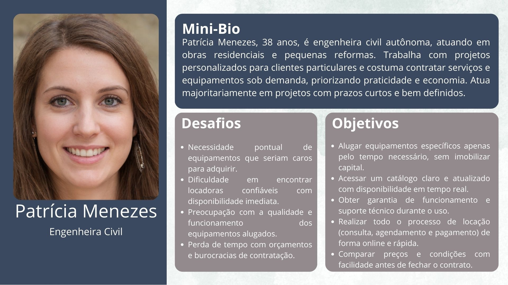
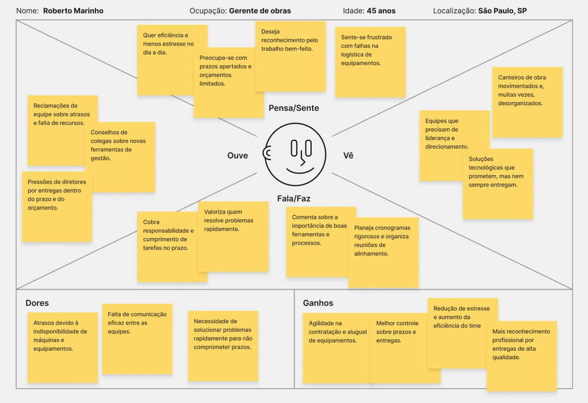
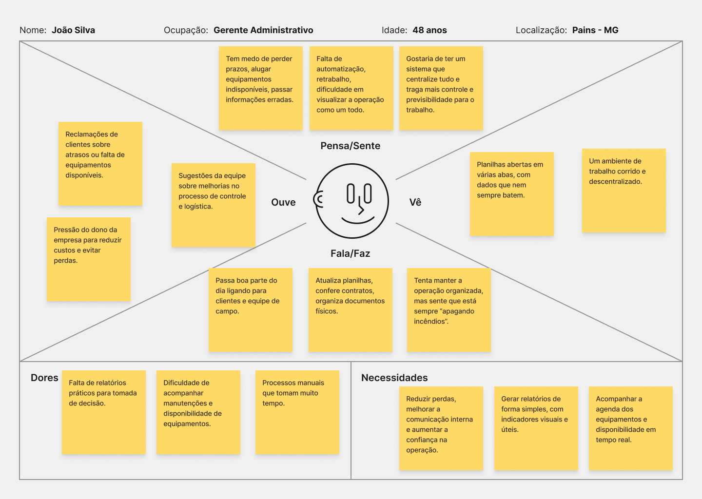
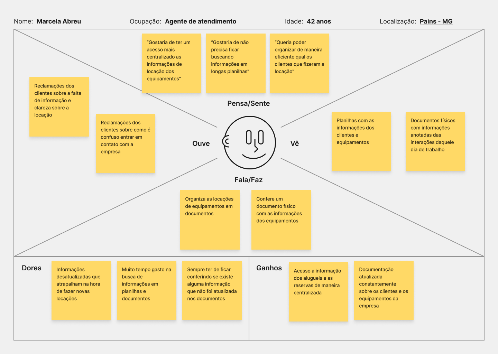
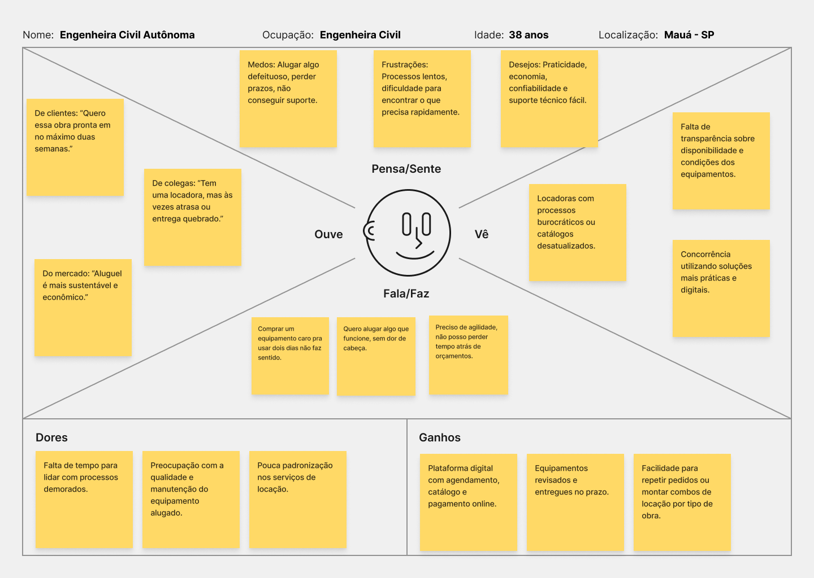
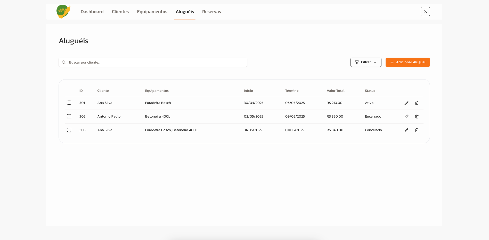
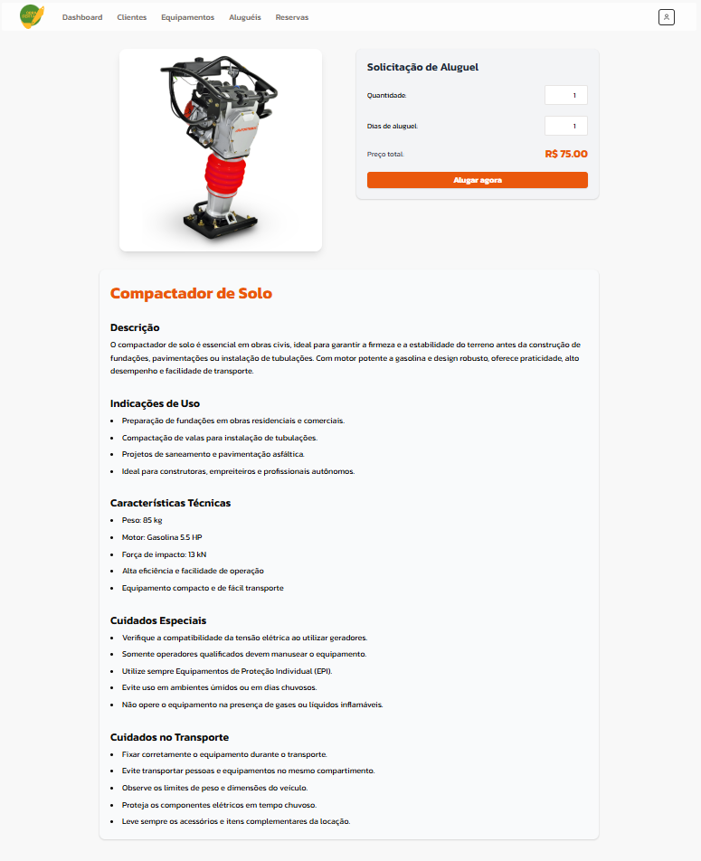
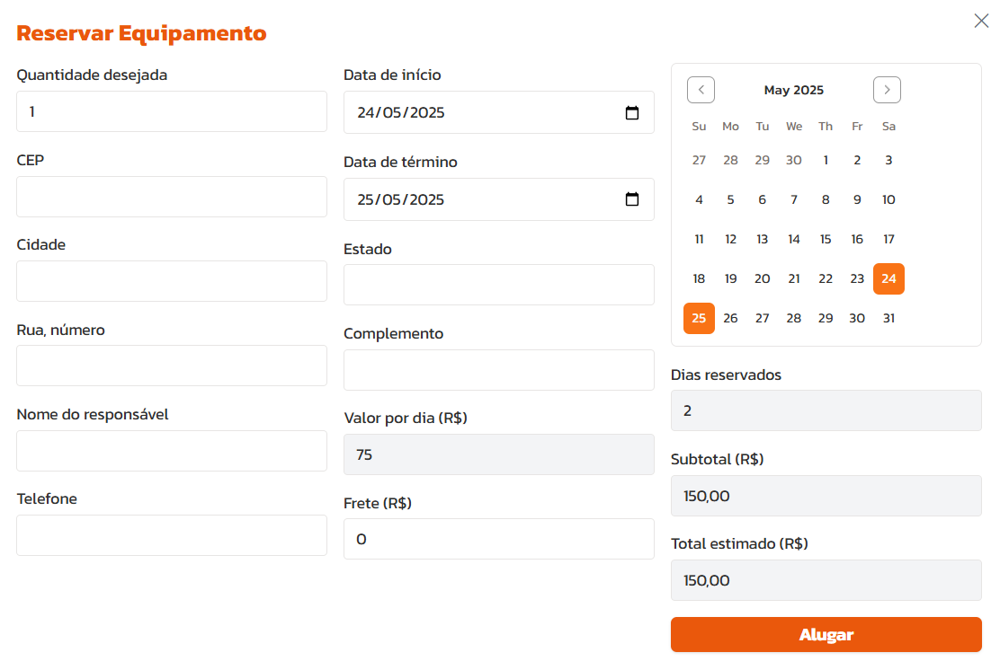

# 4. PROJETO DO DESIGN DE INTERAÇÃO

## 4.1 Personas

### Persona 1: Roberto Marinho

### Persona 2: João Silva

### Persona 3: Marcela Abreu

### Persona 4: Patricia Menezes

## 4.2 Mapa de Empatia

### Mapa de Empatia 1: Roberto Marinho

### Mapa de Empatia 2: João Silva

### Mapa de Empatia 3: Marcela Abreu

### Mapa de Empatia 4: Patricia Menezes

## 4.3 Protótipos das Interfaces

### Tela 1 - Landing Page

Nesta interface da landing page do sistema Obra Certa foram aplicados os princípios gestálticos e as 8 regras de ouro da usabilidade para promover uma navegação fluida, reforçar a hierarquia visual e facilitar a compreensão dos conteúdos. A organização dos elementos, o uso de cores contrastantes e a consistência no layout contribuem para uma experiência clara, intuitiva e eficiente para o usuário.

### Aplicação dos Princípios Gestálticos:

- Proximidade: Agrupamento de elementos relacionados, como campos do formulário e produtos em destaque.
- Similaridade: Uso consistente de estilo visual (botões, cartões, títulos) reforça a identidade visual e facilita a navegação.
- Figura e fundo: Destaque dos elementos principais com bom contraste (ex: botão laranja sobre fundo escuro).
- Continuidade: Leitura fluida da página em rolagem vertical, com alinhamento consistente dos elementos.
- Unidade: A paleta de cores, a tipografia e o espaçamento mantêm a harmonia visual em todas as seções.

### Aplicação das 8 Regras de Ouro:

1. Manter a consistência: Tipografia, botões e espaçamentos seguem padrões claros e replicáveis.
2. Oferecer atalhos: Menus diretos no topo da página agilizam o acesso às principais seções.
3. Oferecer feedback informativo: Botões como “Solicitar Orçamento” dão respostas visuais ao clique.
4. Projetar diálogos para encerramento: A seção de formulário permite conclusão clara com um botão "Enviar".
5. Evitar erros: Campos de formulário identificam claramente o que precisa ser preenchido.
6. Permitir desfazer ações: Ainda que não explicitado no protótipo visual, o formulário pode ser resetado (ex: tecla Delete).
7. Dar suporte a controle do usuário: Navegação livre e não linear pela página, com foco em CTAs claros.
8. Reduzir a carga de memória do usuário: A página é autossuficiente em informações e instruções, com linguagem clara e direta.

### Tela 2 - Dashboard

Nesta interface do dashboard do sistema Obra Certa foram aplicados os princípios gestálticos e as regras de ouro da usabilidade para garantir clareza visual, organização e eficiência na interação do usuário.

### Aplicação dos Princípios Gestálticos:

- Proximidade: Os cards informativos (Novos Clientes, Aluguéis Ativos, etc.) estão dispostos próximos uns dos outros, sendo percebidos como um grupo coeso de métricas relacionadas.
- Boa continuidade (alinhamento): Elementos são organizados em linhas e colunas com alinhamento consistente, o que facilita a leitura sequencial e a navegação visual.
- Simetria: A disposição dos elementos (cards e gráficos) é equilibrada e simétrica, promovendo uma sensação de estabilidade e organização.
- Similaridade: Os cards compartilham o mesmo estilo (cor de fundo, borda, tipografia), o que permite ao usuário identificar rapidamente que são componentes com a mesma função.
- Fecho: O uso de contêineres com bordas suaves e sombras ajuda o usuário a perceber áreas completas, mesmo que algumas bordas estejam mais sutis.
- Região comum: Os cards e os gráficos estão dispostos dentro de áreas bem delimitadas, reforçando o agrupamento de informações.
- Conectividade: Embora não existam linhas de conexão explícitas, a repetição de estilo e alinhamento visual criam uma percepção de conexão entre os elementos relacionados.

### Aplicação das Oito Regras de Ouro:

1. Perseguir a Consistência: Toda a interface segue uma padronização visual e comportamental, com tipografias, cores e espaçamentos consistentes.
2. Fornecer Atalhos: O items do menu de navegação facilitam o acesso rápido a páginas de acesso recorrente.
3. Fornecer Feedbacks Informativos: Cada card exibe indicadores de desempenho (percentuais de aumento/queda), oferecendo feedback imediato ao usuário.
4. Marcar o Final dos Diálogos: Ao clicar em “Gerar Relatório”, o usuário recebe uma ação conclusiva que indica o término do fluxo de consulta de dados.
5. Fornecer Prevenção de Erros e Forma Simples de Corrigi-los: A interface é limpa e com foco nos dados, minimizando distrações e reduzindo chances de cliques equivocados.
6. Permitir a Reversão de Ações: Ainda que esta tela específica não envolva ações destrutivas, a navegação geral do sistema permite retorno seguro a outras páginas sem perda de dados.
7. Fornecer Controle de Iniciativa do Usuário: O usuário pode escolher o período de análise e quando gerar o relatório, mantendo o controle da interação.
8. Reduzir a Carga de Memória de Trabalho: As informações estão todas visíveis em uma única tela, agrupadas por contexto, evitando a necessidade de memorização.

### Tela 3 - Aluguéis

Nesta interface de listagem de aluguéis, foram aplicados fundamentos de design visual com base nos princípios gestálticos e nas regras de ouro da usabilidade, com o objetivo de garantir clareza, organização e uma experiência de uso eficiente.

### Aplicação dos Princípios Gestálticos

- Proximidade: As colunas da tabela e seus respectivos dados estão agrupados com espaçamentos internos adequados, fazendo com que cada linha seja percebida como uma unidade de informação coesa.
- Boa continuidade (alinhamento): A estrutura tabular segue um alinhamento de colunas e botões, favorecendo a leitura horizontal e comparação entre registros.
- Simetria: A composição da tabela e dos botões (filtro e adicionar aluguel) mantém uma estrutura simétrica, contribuindo para um visual limpo e estável.
- Similaridade: Ícones de ações (editar e excluir), botões e campos seguem estilos visuais padronizados, reforçando que desempenham funções semelhantes em diferentes contextos.
- Fecho: As bordas arredondadas e delimitações da tabela permitem que a mente do usuário complete visualmente a área da tabela como um bloco, mesmo que os limites sejam suaves.
- Região comum: Todos os registros da tabela estão contidos dentro de um único bloco delimitado, indicando que pertencem ao mesmo grupo funcional.
- Conectividade: Cada linha apresenta ícones de ação conectados diretamente ao respectivo registro, estabelecendo uma relação funcional clara.

### Aplicação das Oito Regras de Ouro

1. Perseguir a Consistência: Tipografias, espaçamentos, botões e ícones seguem um padrão visual coerente com o restante do sistema.
2. Fornecer Atalhos: A busca por cliente e o botão “Filtrar” oferecem caminhos rápidos para localizar ou refinar dados específicos.
3. Fornecer Feedbacks Informativos: O status dos aluguéis é apresentado de forma clara (“Ativo”, “Encerrado”, “Cancelado”), permitindo ao usuário entender a situação atual de cada item.
4. Marcar o Final dos Diálogos: A ação de “Adicionar Aluguel” dispara a abertura de um modal, delimitando visualmente e funcionalmente o início de um novo fluxo, e permitindo ao usuário entender que está em um estado temporário e isolado até a conclusão ou cancelamento da ação.
5. Fornecer Prevenção de Erros e Forma Simples de Corrigi-los: O layout direto e os ícones com funções específicas reduzem a ambiguidade e a chance de erro.
6. Permitir a Reversão de Ações: Embora não visível diretamente, ícones como a lixeira sugerem ações reversíveis que podem, idealmente, ser acompanhadas de confirmação antes da execução.
7. Fornecer Controle de Iniciativa do Usuário: O usuário pode decidir quando adicionar, filtrar ou editar informações, mantendo o controle total da interface.
8. Reduzir a Carga de Memória de Trabalho: Todas as informações relevantes de cada aluguel estão visíveis em uma única linha, evitando que o usuário tenha que memorizar dados para comparar.

### Tela 4 - Aluguel do equipamento

  

  

Nesta interface da tela de aluguel de equipamento do sistema Obra Certa foram aplicados os princípios gestálticos e as regras de ouro da usabilidade para promover uma navegação fluida, reforçar a hierarquia visual e facilitar a compreensão dos conteúdos. A organização dos elementos, o uso de cores contrastantes e a consistência no layout contribuem para uma experiência clara, intuitiva e eficiente para o usuário.

### Aplicação dos Princípios Gestálticos

- Proximidade: Os campos “Quantidade”, “Dias de aluguel” e “Preço total” estão agrupados visualmente no mesmo bloco, indicando ao usuário que pertencem ao mesmo processo de interação. A imagem do equipamento e sua descrição técnica também são exibidas próximas, sugerindo que se referem ao mesmo item.
- Similaridade: Botões, campos de texto e títulos seguem o mesmo estilo visual (cores, fontes e bordas), facilitando o reconhecimento de padrões e a identificação de elementos com funções semelhantes.
- Continuidade: A organização em colunas e seções verticais cria um fluxo natural de leitura, guiando o olhar do topo para a base da tela de forma fluida e previsível.
- Fechamento: As seções são delimitadas por contêineres com sombras e bordas suaves, permitindo que o usuário perceba blocos completos de informação, mesmo com divisões parciais ou visuais sutis.
- Figura-Fundo: O equipamento em destaque utiliza contraste de cor e posicionamento para se destacar do fundo claro, facilitando sua identificação como elemento principal da página.
- Região Comum: As informações descritivas e técnicas (como “Descrição”, “Características Técnicas” e “Cuidados Especiais”) estão dispostas dentro de um mesmo cartão visual, reforçando que fazem parte de um mesmo grupo de conteúdo.
- Ponto Focal: O botão “Alugar agora”, em cor laranja vibrante e tamanho destacado, atua como o principal ponto de atenção da interface, guiando o usuário à ação esperada.

### Aplicação das Oito Regras de Ouro

1. Perseguir a Consistência: Tipografias, espaçamentos, botões e campos seguem o mesmo padrão visual e funcional das outras telas do sistema.
2. Fornecer Atalhos: A interface permite o aluguel direto do equipamento, sem necessidade de navegação adicional, otimizando o fluxo de ação do usuário.
3. Fornecer Feedbacks Informativos: O valor do aluguel é atualizado automaticamente conforme os campos de quantidade e dias são modificados, oferecendo resposta visual imediata.
4. Marcar o Final dos Diálogos: A finalização do processo ocorre de forma clara com o botão “Alugar agora”, sinalizando o encerramento da ação.
5. Fornecer Prevenção de Erros e Forma Simples de Corrigi-los: Os campos são bem identificados e utilizam valores padrão, minimizando erros no preenchimento.
6. Permitir a Reversão de Ações: O usuário pode ajustar os valores antes de confirmar a solicitação, permitindo correções imediatas.
7. Fornecer Controle de Iniciativa do Usuário: O usuário pode decidir a quantidade, dias de aluguel e o momento de realizar a solicitação, mantendo o controle da interação.
8. Reduzir a Carga de Memória de Trabalho: Todas as informações relevantes estão presentes na mesma tela — descrição do equipamento, informações técnicas e formulário de aluguel — evitando a necessidade de memorização ou troca de páginas.

