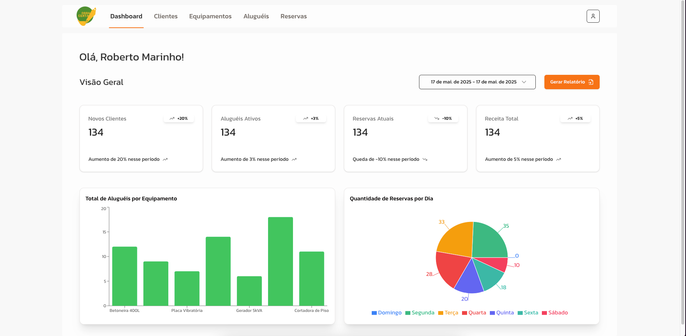

# 4. PROJETO DO DESIGN DE INTERAÇÃO

## 4.1 Personas

Nesta seção você deve detalhar as personas do seu projeto. Deve-se documentar uma persona por integrante do projeto. Sugere-se a utilização do gerador de personas disponibilizado ao final da página https://www.rdstation.com/blog/marketing/persona-o-que-e/.

### Persona 1: Roberto Marinho

### Persona 2: João Silva

### Persona 3: Marcela Abreu

### Persona 4: Patricia Menezes

## 4.2 Mapa de Empatia

Mapa da Empatia é um material utilizado para conhecer melhor o seu cliente. A partir do mapa da empatia é possível detalhar a personalidade do cliente e compreendê-la melhor. O objetivo é obter um nível mais profundo de compreensão de uma persona. A seguir um exemplo de template que pode ser usado para o mapa de empatia. Para cada persona deverá ser apresentado o seu respectivo mapa de empatia. Sugere-se a utilização do template apresentado em https://www.rdstation.com/blog/marketing/mapa-da-empatia/.

### Mapa de Empatia 1: Roberto Marinho

### Mapa de Empatia 2: João Silva

### Mapa de Empatia 3: Marcela Abreu

### Mapa de Empatia 4: Patricia Menezes

## 4.3 Protótipos das Interfaces

Apresente nesta seção os protótipos de alta fidelidade do sistema proposto. A fidelidade do protótipo refere-se ao nível de detalhes e funcionalidades incorporadas a ele. Assim, um protótipo de alta fidelidade é uma representação interativa do produto, baseada no computador ou em dispositivos móveis. Esse protótipo já apresenta maior semelhança com o design final em termos de detalhes e funcionalidades. No desenvolvimento dos protótipos, devem ser considerados os princípios gestálticos, as recomendações ergonômicas e as regras de design (como as 8 regras de ouro). É importante descrever no texto do relatório como os princípios gestálticos e as regras de ouro foram seguidas no projeto das interfaces. Nesta etapa deve-se dar uma ênfase na implementação do software de modo que possam ser realizados os testes com usuários na etapa seguinte.

### Tela 1 - Dashboard

Nesta interface do dashboard do sistema Obra Certa foram aplicados os princípios gestálticos e as regras de ouro da usabilidade para garantir clareza visual, organização e eficiência na interação do usuário.

### Aplicação dos Princípios Gestálticos:

- Proximidade: Os cards informativos (Novos Clientes, Aluguéis Ativos, etc.) estão dispostos próximos uns dos outros, sendo percebidos como um grupo coeso de métricas relacionadas.
- Boa continuidade (alinhamento): Elementos são organizados em linhas e colunas com alinhamento consistente, o que facilita a leitura sequencial e a navegação visual.
- Simetria: A disposição dos elementos (cards e gráficos) é equilibrada e simétrica, promovendo uma sensação de estabilidade e organização.
- Similaridade: Os cards compartilham o mesmo estilo (cor de fundo, borda, tipografia), o que permite ao usuário identificar rapidamente que são componentes com a mesma função.
- Fecho: O uso de contêineres com bordas suaves e sombras ajuda o usuário a perceber áreas completas, mesmo que algumas bordas estejam mais sutis.
- Região comum: Os cards e os gráficos estão dispostos dentro de áreas bem delimitadas, reforçando o agrupamento de informações.
- Conectividade: Embora não existam linhas de conexão explícitas, a repetição de estilo e alinhamento visual criam uma percepção de conexão entre os elementos relacionados.

### Aplicação das Oito Regras de Ouro:

1. Perseguir a Consistência: Toda a interface segue uma padronização visual e comportamental, com tipografias, cores e espaçamentos consistentes.
2. Fornecer Atalhos: O items do menu de navegação facilitam o acesso rápido a páginas de acesso recorrente.
3. Fornecer Feedbacks Informativos: Cada card exibe indicadores de desempenho (percentuais de aumento/queda), oferecendo feedback imediato ao usuário.
4. Marcar o Final dos Diálogos: Ao clicar em “Gerar Relatório”, o usuário recebe uma ação conclusiva que indica o término do fluxo de consulta de dados.
5. Fornecer Prevenção de Erros e Forma Simples de Corrigi-los: A interface é limpa e com foco nos dados, minimizando distrações e reduzindo chances de cliques equivocados.
6. Permitir a Reversão de Ações: Ainda que esta tela específica não envolva ações destrutivas, a navegação geral do sistema permite retorno seguro a outras páginas sem perda de dados.
7. Fornecer Controle de Iniciativa do Usuário: O usuário pode escolher o período de análise e quando gerar o relatório, mantendo o controle da interação.
8. Reduzir a Carga de Memória de Trabalho: As informações estão todas visíveis em uma única tela, agrupadas por contexto, evitando a necessidade de memorização.
