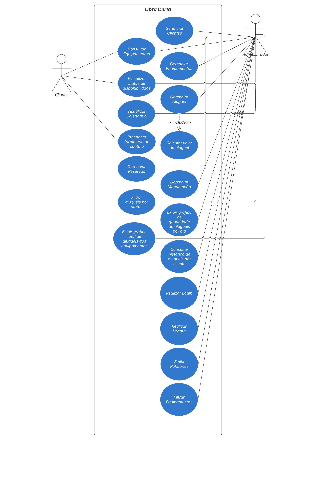

# 3. DOCUMENTO DE ESPECIFICAÇÃO DE REQUISITOS DE SOFTWARE

Nesta parte do trabalho você deve detalhar a documentação dos requisitos do sistema proposto de acordo com as seções a seguir. Ressalta-se que aqui é utilizado como exemplo um sistema de gestão de cursos de aperfeiçoamento.

## 3.1 Objetivos deste documento
Este documento tem como objetivo descrever e especificar os requisitos funcionais e não funcionais do sistema Obra Certa, atendendo às necessidades da empresa de aluguel de equipamentos e máquinas, bem como de seus clientes. Ele servirá como base para o desenvolvimento e validação do sistema, garantindo que as funcionalidades essenciais para a operação sejam contempladas.

## 3.2 Escopo do produto

### 3.2.1 Nome do produto e seus componentes principais
O sistema será denominado Obra Certa – Sistema de Aluguel e Gerenciamento de Equipamentos. Seus principais módulos incluem:

    Gerenciamento de Equipamentos

    Gerenciamento de Clientes

    Controle de Manutenções

Esses módulos fornecerão suporte completo para a operação de aluguel de maquinário, desde o cadastro e acompanhamento dos equipamentos até o relacionamento com os clientes e a manutenção dos ativos.

### 3.2.2 Missão do produto
O Obra Certa tem como missão otimizar o processo de aluguel de equipamentos, promovendo maior eficiência na gestão dos recursos, maior controle operacional e melhor experiência para os usuários da empresa.

### 3.2.3 Limites do produto
O sistema Obra Certa é voltado exclusivamente para a gestão de aluguéis de equipamentos e máquinas. Ele não contempla funcionalidades relacionadas à venda de equipamentos, limitando-se à operação de locação e controle de manutenção.

### 3.2.4 Benefícios do produto

| #   | Benefício                                                           | Valor para o Cliente |
| --- | ------------------------------------------------------------------- | -------------------- |
| 1   | Facilidade no cadastro de clientes e equipamentos                   | Essencial            |
| 2   | Agilidade na recuperação de informações e históricos                | Essencial            |
| 3   | Maior controle sobre a disponibilidade dos equipamentos             | Essencial            |
| 4   | Redução de erros manuais nas operações de aluguel                   | Essencial            |
| 5   | Visão clara de dados operacionais por meio de relatórios e gráficos | Recomendável         |
| 6   | Comunicação facilitada com os clientes via formulário               | Recomendável         |
| 7   | Registro e acompanhamento de manutenções                            | Essencial            |
| 8   | Planejamento eficiente com visualização de calendário               | Recomendável         |

## 3.3 Descrição geral do produto

### 3.3.1 Requisitos Funcionais

| Código | Requisito Funcional (Funcionalidade)                                  | Descrição                                                                                                                |
| ------ | --------------------------------------------------------------------- | ------------------------------------------------------------------------------------------------------------------------ |
| RF1    | Gerenciar Clientes                                                    | Processamento de Inclusão, Alteração, Exclusão e Consulta de clientes                                                    |
| RF2    | Gerenciar Equipamentos                                                | Processamento de Inclusão, Alteração, Exclusão de equipamentos                                                           |
| RF3    | Consultar Equipamentos                                                | Processamento de Consulta de equipamentos                                                                                |
| RF4    | Gerenciar Aluguel                                                     | Processamento de Inclusão, Alteração, Exclusão e Consulta de aluguéis                                                    |
| RF5    | Gerenciar Manutenções                                                 | Processamento de Inclusão, Alteração, Exclusão e Consulta de manutenções dos equipamentos                                |
| RF6    | Filtrar equipamentos                                                  | Implementar filtros de equipamentos por tipo/categoria                                                                   |
| RF7    | Visualizar status de disponibilidade                                  | Mostrar o status de disponibilidade dos equipamentos                                                                     |
| RF8    | Visualizar calendário                                                 | Exibir calendário com datas disponíveis para cada equipamento                                                            |
| RF9    | Cálcular valor de aluguel                                             | Calcular automaticamente o valor total do aluguel com base no tempo e valor de cada equipamento                          |
| RF10   | Registrar reservas futuras                                            | Permitir o registro de reservas futuras de equipamentos                                                                  |
| RF11   | Filtrar aluguéis por status                                           | Implementar filtros de aluguéis por status para o administrador                                                          |
| RF12   | Exibir gráfico de quantidade de aluguéis por dia                      | Exibir gráficos de quantidade de aluguéis realizados por dia, na página inicial do painel admin                          |
| RF13   | Exibir gráfico de total de aluguéis dos equipamentos                  | Exibir gráficos com o número total de vezes que cada equipamento foi alugado, na página inicial do painel admin          |
| RF14   | Disponibilizar formulário para contato                                | Disponibilizar formulário de contato para solicitações de clientes, na landing page                                      |
| RF15   | Consultar histórico de aluguéis por cliente                           | Visualizar histórico completo de aluguéis realizados por cliente específico                                              |
| RF16   | Realizar login                                                        | Permitir que o admin do sistema (funcionário da empresa) consiga logar no sistema admin, com credenciais pré-cadastradas |
| RF17   | Realizar logout                                                       | Permitir que o admin do sistema (funcionário da empresa) consiga deslogar do sistema admin                               |
| RF18   | Permitir consulta de relatórios de quantidade de aluguéis por dia     | Exibir relatório de quantidade de aluguéis realizados por dia                                                            |
| RF19   | Permitir consulta de relatórios de total de aluguéis dos equipamentos | Exibir relatório com o número total de vezes que cada equipamento foi alugado                                            |

### 3.3.2 Requisitos Não Funcionais

| Código | Requisito Não Funcional (Restrição)                                                                                       |
| ------ | ------------------------------------------------------------------------------------------------------------------------- |
| RNF1   | A landing page deve se adaptar corretamente a todos os tamanhos de tela, desde dispositivos móveis até monitores desktop. |
| RNF2   | O sistema deve estar disponível pelo menos 99,5% do tempo.                                                                |
| RNF3   | O código-fonte deve seguir padrões de boas práticas para facilitar futuras manutenções.                                   |
| RNF4   | O sistema deve ser acessível via navegadores modernos, sem perdas de funcionalidades.                                     |
| RNF5   | O sistema deve estar em conformidade com a Lei Geral de Proteção de Dados.                                                |
| RNF6   | O design do sistema deve seguir uma identidade visual intuitiva e padronizada, garantindo uma boa usabilidade.            |
| RNF7   | O sistema deve exigir autenticação para que o administrador acesse funcionalidades restritas.                             |

### 3.3.3 Usuários

| Ator          | Descrição                                                                                                                                                            |
| ------------- | -------------------------------------------------------------------------------------------------------------------------------------------------------------------- |
| Administrador | Usuário responsável pelo gerenciamento do sistema. Possui acesso para gerenciar clientes, equipamentos e aluguéis, além de visualizar relatórios e estatísticas.     |
| Cliente       | Usuário que interage apenas com a landing page para conhecer os serviços da empresa, visualizar os equipamentos disponíveis e entrar em contato com o administrador. |

## 3.4 Modelagem do Sistema

### 3.4.1 Diagrama de Casos de Uso
Como apresentado no diagrama de casos de uso da Figura 1, o Administrador poderá gerenciar não apenas os clientes e os equipamentos, mas também os aluguéis. Já o Cliente poderá visualizar os equipamentos disponíveis e solicitar que entrem em contato com ele.

#### Figura 1: Diagrama de Casos de Uso do Sistema.

### 3.4.2 Descrições de Casos de Uso

### Gerenciar Cliente (CSU01)
Sumário: O Administrador realiza a gestão (inclusão, remoção, alteração e consulta) dos dados dos clientes.

Ator Primário: Administrador.

Ator Secundário: — (não se aplica neste caso).

Pré-condições: O Administrador deve estar autenticado no sistema.

Fluxo Principal:
1) O Administrador acessa a funcionalidade de gerenciamento de clientes.  
2) O Sistema apresenta as operações disponíveis: inclusão de um novo cliente, alteração de dados de um cliente, exclusão de um cliente e consulta de informações.  
3) O Administrador seleciona a operação desejada: Inclusão, Exclusão, Alteração ou Consulta, ou opta por finalizar o caso de uso.  
4) Se desejar continuar o gerenciamento de clientes, o caso de uso retorna ao passo 2; caso contrário, o caso de uso é encerrado.  

Fluxo Alternativo (1): Inclusão

a) O Administrador requisita a inclusão de um novo cliente.  
b) O Sistema solicita o CPF ou outro identificador do cliente.  
c) O Administrador fornece o dado solicitado.  
d) O Sistema verifica se o cliente já está cadastrado. Se estiver, informa o fato e retorna ao início; caso contrário, apresenta um formulário para preenchimento com os dados do cliente (Nome, CPF, Email, Telefone, Endereço, etc.).  
e) O Administrador preenche os dados e confirma a inclusão.  
f) O Sistema valida os dados informados. Se forem válidos, o novo cliente é adicionado ao banco de dados e a lista de clientes é atualizada; se não forem válidos, o sistema exibe uma mensagem de erro e solicita a correção.  

Fluxo Alternativo (2): Remoção

a) O Administrador seleciona um cliente da lista e solicita sua exclusão.  
b) O Sistema verifica se o cliente pode ser removido (ex.: não possui aluguéis ativos).  
c) Se for possível, o Sistema realiza a remoção e atualiza a lista; caso contrário, exibe uma mensagem informando o impedimento.  

Fluxo Alternativo (3): Alteração

a) O Administrador seleciona um cliente e edita um ou mais campos de seu cadastro.  
b) O Sistema verifica a validade das alterações. Se forem válidas, atualiza os dados; caso contrário, informa o erro.  

Fluxo Alternativo (4): Consulta

a) O Administrador realiza uma busca pelo nome, CPF ou outro critério.  
b) O Sistema exibe uma lista de clientes correspondentes.  
c) O Administrador seleciona um cliente.  
d) O Sistema exibe os dados detalhados do cliente.  

Pós-condições:
Um cliente foi inserido ou removido, seus dados foram modificados ou exibidos ao Administrador.

---

### Consultar Equipamentos (CSU02)

Sumário: O Cliente e o Administrador consultam a lista de equipamentos cadastrados no sistema, podendo visualizar informações como nome, categoria, especificações e disponibilidade.

Atores Primários: Cliente, Administrador.

Atores Secundários: — (não se aplica).

Pré-condições: O Cliente ou o Administrador deve estar autenticado no sistema.

Fluxo Principal:
1) O Cliente ou o Administrador acessa a funcionalidade de consulta de equipamentos.  
2) O Sistema apresenta as opções de filtro e busca, permitindo refinar a consulta por nome, categoria ou disponibilidade.  
3) O ator preenche os filtros desejados e confirma a busca.  
4) O Sistema exibe a lista de equipamentos que atendem aos critérios informados.  
5) O ator seleciona um equipamento para visualizar seus detalhes.  
6) O Sistema exibe as informações detalhadas do equipamento.  
7) O ator pode optar por realizar uma nova consulta ou encerrar o processo.  

Fluxo Alternativo (1): Consulta sem Filtros

a) O Cliente ou o Administrador opta por consultar todos os equipamentos sem aplicar filtros.  
b) O Sistema exibe a lista completa de equipamentos cadastrados.  
c) O fluxo segue a partir do passo 5 do fluxo principal.  

Pós-condições:
A lista de equipamentos foi apresentada com sucesso, e os dados de um ou mais equipamentos foram visualizados.

---

### Gerenciar Equipamentos (CSU03)

Sumário: O Administrador realiza a gestão (inclusão, remoção, alteração e consulta) dos dados dos equipamentos disponíveis no sistema.

Ator Primário: Administrador.

Ator Secundário: — (não se aplica).

Pré-condições:
O Administrador deve estar autenticado no sistema.

Fluxo Principal:
1. O Administrador acessa a funcionalidade de gerenciamento de equipamentos.   
2. O Sistema apresenta as operações disponíveis: inclusão de novo equipamento, alteração de dados, exclusão e consulta de informações.  
3. O Administrador seleciona a operação desejada: Inclusão, Exclusão, Alteração ou Consulta, ou opta por finalizar o caso de uso.  
4. Se desejar continuar o gerenciamento de equipamentos, o caso de uso retorna ao passo 2; caso contrário, o caso de uso é encerrado.  

Fluxo Alternativo (1): Inclusão

a) O Administrador requisita a inclusão de um novo equipamento.  
b) O Sistema solicita um identificador (ex.: código interno) do equipamento.  
c) O Administrador fornece o dado solicitado.  
d) O Sistema verifica se o equipamento já está cadastrado. Se estiver, informa o fato e retorna ao início; caso contrário, apresenta um formulário para preenchimento com os dados do equipamento (Nome, Categoria, Descrição, Quantidade, Status de Disponibilidade, etc.).  
e) O Administrador preenche os dados e confirma a inclusão.  
f) O Sistema valida os dados informados. Se forem válidos, o equipamento é adicionado ao banco de dados e a lista é atualizada; se não forem válidos, o sistema exibe uma mensagem de erro e solicita a correção.  

Fluxo Alternativo (2): Remoção

a) O Administrador seleciona um equipamento da lista e solicita sua exclusão.  
b) O Sistema verifica se o equipamento pode ser removido (ex.: não está associado a aluguéis ativos).  
c) Se possível, o Sistema realiza a remoção e atualiza a lista; caso contrário, exibe uma mensagem informando o impedimento.  

Fluxo Alternativo (3): Alteração

a) O Administrador seleciona um equipamento e edita um ou mais campos de seu cadastro.  
b) O Sistema verifica a validade das alterações. Se forem válidas, atualiza os dados; caso contrário, informa o erro.  

Fluxo Alternativo (4): Consulta

a) O Administrador realiza uma busca por nome, código ou categoria.  
b) O Sistema exibe uma lista de equipamentos correspondentes.  
c) O Administrador seleciona um equipamento.  
d) O Sistema exibe os dados detalhados do equipamento.  

Pós-condições:
Um equipamento foi inserido ou removido, seus dados foram modificados ou exibidos ao Administrador.

---

### Visualizar Status de Disponibilidade (CSU04)

Sumário: O Cliente e o Administrador visualizam o status de disponibilidade dos equipamentos cadastrados no sistema, podendo verificar se estão livres para aluguel ou em uso.

Atores Primários: Cliente, Administrador.

Atores Secundários: — (não se aplica).

Pré-condições: O Cliente ou o Administrador deve estar autenticado no sistema.

Fluxo Principal:

1. O Cliente ou o Administrador acessa a funcionalidade de visualização de disponibilidade.  
2. O Sistema apresenta uma interface de busca e filtro com opções como nome do equipamento, categoria ou status atual.  
3. O ator aplica os filtros desejados e confirma a pesquisa.  
4. O Sistema exibe uma lista de equipamentos com seus respectivos status de disponibilidade (Disponível, Reservado, Em uso, Em manutenção etc.).  
5. O ator pode selecionar um equipamento da lista para obter mais detalhes.  
6. O Sistema exibe os dados detalhados, incluindo o status atualizado e informações relevantes (último aluguel, próxima devolução, etc.).  
7. O ator pode optar por realizar outra consulta ou encerrar o processo.  

Fluxo Alternativo (1): Sem Filtros Aplicados

a) O Cliente ou o Administrador opta por visualizar todos os equipamentos com seus respectivos status.  
b) O Sistema apresenta a lista completa, indicando a disponibilidade de cada item.  
c) O fluxo segue a partir do passo 5 do fluxo principal.  

Pós-condições:
A disponibilidade dos equipamentos foi consultada com sucesso, e os dados foram exibidos ao ator.

---

### Gerenciar Aluguel (CSU05)

Sumário: O Administrador realiza a gestão dos aluguéis de equipamentos, incluindo a criação, atualização, finalização e consulta de aluguéis vinculados aos clientes. Durante a inclusão de um novo aluguel, o sistema executa o caso de uso Calcular Valor do Aluguel.

Atores Primários: Administrador.

Atores Secundários: — (não se aplica).

Pré-condições: O Administrador deve estar autenticado no sistema.

Fluxo Principal:

1. O Administrador acessa a funcionalidade de gerenciamento de aluguéis.  
2. O Sistema apresenta as opções disponíveis: iniciar novo aluguel, editar um aluguel existente, finalizar aluguel e consultar histórico.  
3. O Administrador seleciona a operação desejada.  
4. O Sistema solicita as informações necessárias para realizar a operação.  
5. O Administrador fornece os dados solicitados (como cliente, equipamento, datas de início e término).  
6. O Sistema executa o caso de uso "Calcular Valor do Aluguel".  
7. O Sistema exibe o valor total do aluguel com base no período e nos equipamentos selecionados.  
8. O Administrador confirma os dados e a operação.  
9. O Sistema registra a ação e atualiza os dados relacionados ao aluguel e ao equipamento.  
10. O Administrador pode optar por realizar outra operação ou encerrar o processo.  

Fluxo Alternativo (1): Finalização de Aluguel

a) O Administrador seleciona um aluguel ativo e solicita a finalização.  
b) O Sistema solicita a confirmação da devolução do equipamento.  
c) Após confirmação, o Sistema atualiza o status do aluguel para "Finalizado" e o status do equipamento para "Disponível".  

Fluxo Alternativo (2): Consulta de Histórico

a) O Administrador realiza busca por cliente, equipamento ou período.  
b) O Sistema apresenta uma lista com os aluguéis correspondentes aos critérios.  
c) O Administrador pode visualizar os detalhes de cada aluguel.  

Pós-condições:
O aluguel foi criado, alterado, finalizado ou consultado com sucesso, e o status dos equipamentos foi atualizado conforme necessário. O valor do aluguel foi calculado automaticamente pelo sistema.

---

### Calcular Valor do Aluguel (CSU06)

Sumário: O sistema calcula automaticamente o valor total do aluguel com base no período de locação e nos equipamentos selecionados, incluindo regras de preço e eventuais taxas.

Atores Primários: Administrador.

Atores Secundários: — (não se aplica).

Pré-condições: O Administrador deve estar autenticado e o processo de criação de aluguel deve estar em andamento.

Fluxo Principal:

1. O Sistema recebe a data de início, data de término e os equipamentos selecionados.  
2. O Sistema verifica o preço por dia de cada equipamento.  
3. O Sistema calcula o total com base no número de dias e no valor de cada equipamento.  
4. O Sistema pode incluir taxas adicionais se aplicáveis (ex: manutenção, seguro).  
5. O valor total é apresentado ao Administrador para confirmação.  

Pós-condições:
O valor do aluguel é exibido ao Administrador para prosseguimento no processo de locação.

---

### Visualizar Calendário (CSU07)

Sumário: O Administrador visualiza o calendário com os períodos de locação de cada equipamento, facilitando o controle de disponibilidade e o planejamento de novos aluguéis.

Atores Primários: Administrador.

Atores Secundários: — (não se aplica).

Pré-condições: O Administrador deve estar autenticado no sistema.

Fluxo Principal:

1. O Administrador acessa a funcionalidade de visualização do calendário.  
2. O Sistema apresenta o calendário com a visão mensal, semanal ou diária, conforme preferência do Administrador.  
3. O Sistema exibe os períodos de locação dos equipamentos no calendário, com destaque visual para os dias reservados, disponíveis e em manutenção.  
4. O Administrador pode aplicar filtros por equipamento, categoria ou cliente.  
5. O Administrador seleciona um período ou evento específico no calendário.  
6. O Sistema exibe os detalhes da locação correspondente, como cliente, equipamento, data de início e fim.  
7. O Administrador pode optar por continuar navegando no calendário ou encerrar o processo.  

Fluxo Alternativo (1): Sem Reservas no Período

a) O Administrador acessa um período onde não há reservas registradas.  
b) O Sistema exibe o calendário normalmente, com os dias sem marcação de uso.  
c) O Administrador pode voltar a outro período ou aplicar filtros diferentes.  

Pós-condições:
O Administrador visualizou o calendário com as informações de uso e disponibilidade dos equipamentos.

---

### Preencher Formulário de Contato (CSU08)

Sumário: O Cliente preenche um formulário de contato para solicitar informações adicionais, tirar dúvidas ou pedir retorno da empresa responsável pela locação dos equipamentos.

Atores Primários: Cliente.

Atores Secundários: — (não se aplica).

Pré-condições: O Cliente deve estar autenticado no sistema.

Fluxo Principal:

1. O Cliente acessa a funcionalidade de formulário de contato.  
2. O Sistema apresenta um formulário com campos como nome, email, telefone, assunto e mensagem.  
3. O Cliente preenche os campos obrigatórios com suas informações e escreve a mensagem desejada.  
4. O Cliente envia o formulário.  
5. O Sistema valida os dados inseridos.  
6. Se os dados forem válidos, o Sistema registra a solicitação e exibe uma mensagem de confirmação.  
7. O Cliente pode optar por preencher um novo formulário ou encerrar o processo.  

Fluxo Alternativo (1): Dados Inválidos

a) O Sistema identifica campos obrigatórios não preenchidos ou dados inválidos.  
b) O Sistema exibe uma mensagem de erro solicitando a correção.  
c) O Cliente ajusta os dados e tenta reenviar o formulário.  

Pós-condições:
A solicitação de contato foi registrada com sucesso e estará disponível para análise pela equipe administrativa.

---

### Registrar Reservas Futuras (CSU09)

Sumário: O Administrador registra reservas de equipamentos para datas futuras, garantindo a disponibilidade dos itens para os clientes com antecedência.

Atores Primários: Administrador.

Atores Secundários: — (não se aplica).

Pré-condições: O Administrador deve estar autenticado no sistema.

Fluxo Principal:

1. O Administrador acessa a funcionalidade de registro de reservas futuras.  
2. O Sistema exibe um formulário solicitando as informações da reserva: cliente, equipamento, data de início e data de término.  
3. O Administrador preenche os campos obrigatórios e confirma a solicitação.  
4. O Sistema verifica a disponibilidade do equipamento para o período selecionado.  
5. Se disponível, o Sistema registra a reserva e atualiza o calendário e a agenda de aluguéis futuros.  
6. O Sistema exibe uma mensagem de confirmação com os dados da reserva.  
7. O Administrador pode optar por registrar outra reserva ou encerrar o processo.  

Fluxo Alternativo (1): Equipamento Indisponível

a) O Sistema identifica que o equipamento já está reservado ou alugado para o período informado.  
b) O Sistema exibe uma mensagem informando a indisponibilidade.  
c) O Administrador pode escolher outro período ou equipamento, ou cancelar o processo.  

Pós-condições:
Uma reserva futura foi registrada com sucesso e o equipamento ficou indisponível para o período correspondente.

---

### Gerenciar Manutenção (CSU10)

Sumário: O Administrador realiza o controle de manutenções dos equipamentos, podendo registrar novas manutenções, atualizar status e consultar o histórico de intervenções.

Atores Primários: Administrador.

Atores Secundários: — (não se aplica).

Pré-condições: O Administrador deve estar autenticado no sistema.

Fluxo Principal:

1. O Administrador acessa a funcionalidade de gerenciamento de manutenções.  
2. O Sistema apresenta as opções disponíveis: registrar nova manutenção, atualizar status de manutenção e consultar histórico.  
3. O Administrador seleciona a operação desejada.  
4. O Sistema solicita as informações necessárias para executar a ação (ex.: equipamento, tipo de manutenção, datas, observações).  
5. O Administrador preenche os dados e confirma a operação.  
6. O Sistema valida as informações fornecidas.  
7. Se válidas, o Sistema executa a ação e atualiza o status do equipamento (ex.: Em manutenção, Disponível, etc.).  
8. O Administrador pode optar por realizar outra operação ou encerrar o processo.  

Fluxo Alternativo (1): Dados Inválidos

a) O Sistema identifica que dados obrigatórios estão ausentes ou inválidos.  
b) O Sistema informa o erro ao Administrador e solicita a correção.  
c) O Administrador corrige os dados e reenvia a solicitação.  

Pós-condições:
Uma nova manutenção foi registrada, uma manutenção existente foi atualizada ou o histórico foi consultado com sucesso. O status do equipamento foi alterado conforme necessário.

---

### Exibir Gráfico de Quantidade de Aluguéis por Dia (CSU11)

Sumário: O Administrador visualiza um gráfico com a quantidade de aluguéis realizados por dia, auxiliando na análise de desempenho e no planejamento da operação.

Atores Primários: Administrador.

Atores Secundários: — (não se aplica).

Pré-condições: O Administrador deve estar autenticado no sistema.

Fluxo Principal:

1. O Administrador acessa a funcionalidade de exibição de gráfico de aluguéis por dia.  
2. O Sistema apresenta opções de filtro como intervalo de datas, categoria de equipamentos ou cliente.  
3. O Administrador seleciona os filtros desejados e confirma.  
4. O Sistema processa os dados com base nos critérios informados.  
5. O Sistema exibe o gráfico de barras ou linhas representando a quantidade de aluguéis por dia no período selecionado.  
6. O Administrador analisa as informações e pode optar por exportar os dados, alterar os filtros ou encerrar o processo.  

Fluxo Alternativo (1): Sem Dados no Período

a) O Sistema identifica que não há aluguéis registrados no intervalo selecionado.  
b) O Sistema exibe uma mensagem informando a ausência de dados.  
c) O Administrador pode selecionar outro intervalo ou encerrar o processo.  

Pós-condições:
O gráfico foi exibido com sucesso, permitindo ao Administrador analisar o volume de aluguéis por dia.

---

### Filtrar Aluguéis por Status (CSU12)

Sumário: O Administrador filtra a lista de aluguéis com base no status atual (ativo, finalizado, reservado, cancelado), facilitando a gestão e análise das locações.

Atores Primários: Administrador.

Atores Secundários: — (não se aplica).

Pré-condições: O Administrador deve estar autenticado no sistema.

Fluxo Principal:

1. O Administrador acessa a funcionalidade de gerenciamento ou consulta de aluguéis.  
2. O Sistema apresenta uma interface com filtros disponíveis, incluindo o filtro por status.  
3. O Administrador seleciona um ou mais status desejados (ex.: Ativo, Finalizado, Reservado, Cancelado).  
4. O Sistema filtra a lista de aluguéis com base nos critérios selecionados.  
5. O Sistema exibe a lista resultante com os aluguéis que possuem o(s) status selecionado(s).  
6. O Administrador pode visualizar detalhes de um aluguel, aplicar novos filtros ou encerrar o processo.  

Fluxo Alternativo (1): Nenhum Aluguel com o Status Selecionado

a) O Sistema identifica que não existem aluguéis com o status informado.  
b) O Sistema exibe uma mensagem informando que não há resultados.  
c) O Administrador pode escolher outro filtro ou encerrar o processo.  

Pós-condições:
O Administrador obteve uma lista filtrada de aluguéis conforme o status selecionado.

---

### Exibir Gráfico de Total de Aluguéis por Equipamentos (CSU13)

Sumário: O Administrador visualiza um gráfico com o total de aluguéis realizados por cada equipamento, facilitando a análise de demanda e o controle de uso dos itens.

Atores Primários: Administrador.

Atores Secundários: — (não se aplica).

Pré-condições: O Administrador deve estar autenticado no sistema.

Fluxo Principal:

1. O Administrador acessa a funcionalidade de exibição de gráfico de aluguéis por equipamento.  
2. O Sistema apresenta filtros disponíveis, como intervalo de datas, categorias de equipamento ou cliente.  
3. O Administrador seleciona os filtros desejados e confirma.  
4. O Sistema processa os dados com base nos critérios fornecidos.  
5. O Sistema exibe um gráfico (de barras, pizza ou linhas) representando o total de aluguéis realizados por equipamento no período selecionado.  
6. O Administrador analisa as informações apresentadas e pode exportar o gráfico, modificar os filtros ou encerrar o processo.  

Fluxo Alternativo (1): Sem Dados no Período

a) O Sistema identifica que não há aluguéis registrados para os equipamentos no período informado.  
b) O Sistema exibe uma mensagem informando a ausência de dados.  
c) O Administrador pode alterar os filtros ou encerrar o processo.  

Pós-condições:
O gráfico com o total de aluguéis por equipamento foi exibido ao Administrador com sucesso.

---

### Consultar Histórico de Aluguéis por Cliente (CSU14)

Sumário: O Administrador consulta o histórico de aluguéis realizados por um cliente específico, permitindo o acompanhamento do relacionamento e uso dos equipamentos ao longo do tempo.

Atores Primários: Administrador.

Atores Secundários: — (não se aplica).

Pré-condições: O Administrador deve estar autenticado no sistema.

Fluxo Principal:

1. O Administrador acessa a funcionalidade de consulta de histórico de aluguéis.  
2. O Sistema apresenta um campo para busca por cliente (nome, CPF, ou outro identificador).  
3. O Administrador informa o cliente desejado e confirma a busca.  
4. O Sistema exibe a lista de aluguéis realizados pelo cliente, incluindo datas, equipamentos e status de cada aluguel.  
5. O Administrador pode selecionar um aluguel específico para visualizar detalhes completos.  
6. O Sistema exibe os dados detalhados da locação, como período, valor, status e observações.  
7. O Administrador pode consultar outro cliente, aplicar filtros adicionais ou encerrar o processo.  

Fluxo Alternativo (1): Cliente sem Histórico de Aluguéis

a) O Sistema identifica que o cliente não possui registros de aluguéis.  
b) O Sistema exibe uma mensagem informando que não há histórico para o cliente informado.  
c) O Administrador pode buscar outro cliente ou encerrar o processo.  

Pós-condições:
O histórico de aluguéis do cliente foi exibido ao Administrador com sucesso, ou foi informada a ausência de registros.

---

### Realizar Login (CSU15)

Sumário: O Administrador realiza a autenticação no sistema por meio de login e senha, obtendo acesso às funcionalidades disponíveis conforme seu perfil.

Atores Primários: Administrador.

Atores Secundários: — (não se aplica).

Pré-condições: O Administrador deve estar previamente cadastrado no sistema.

Fluxo Principal:

1. O Administrador acessa a tela de login do sistema.  
2. O Sistema apresenta campos para inserção de login (usuário ou email) e senha.  
3. O Administrador insere suas credenciais e solicita o acesso.  
4. O Sistema valida os dados fornecidos.  
5. Se os dados estiverem corretos, o Sistema autentica o Administrador e redireciona para a tela inicial com acesso às funcionalidades autorizadas.  
6. O Administrador passa a interagir com o sistema como usuário autenticado.  

Fluxo Alternativo (1): Credenciais Inválidas

a) O Sistema identifica que o login ou a senha estão incorretos.  
b) O Sistema exibe uma mensagem de erro solicitando nova tentativa.  
c) O Administrador pode tentar novamente ou encerrar o processo.  

Pós-condições:
O Administrador foi autenticado com sucesso e teve acesso ao sistema, ou foi informado de erro nas credenciais.

---

### Realizar Logout (CSU16)

Sumário: O Administrador encerra sua sessão no sistema de forma segura, finalizando o acesso às funcionalidades restritas.

Atores Primários: Administrador.

Atores Secundários: — (não se aplica).

Pré-condições: O Administrador deve estar autenticado no sistema.

Fluxo Principal:

1. O Administrador acessa a opção de logout disponível na interface do sistema.  
2. O Sistema solicita a confirmação da ação de logout.  
3. O Administrador confirma a intenção de encerrar a sessão.  
4. O Sistema finaliza a sessão ativa e redireciona o Administrador para a tela de login ou página inicial pública.  

Fluxo Alternativo (1): Cancelamento de Logout

a) O Administrador decide cancelar a ação de logout.  
b) O Sistema mantém a sessão ativa e retorna para a interface anterior.  

Pós-condições:
A sessão foi encerrada com sucesso, e o Administrador não possui mais acesso às funcionalidades do sistema até novo login.

---

### Permitir Consulta de Relatório de Quantidade de Aluguel por Dia (CSU17)

Sumário: O Administrador consulta um relatório que apresenta a quantidade de aluguéis realizados por dia dentro de um determinado período, facilitando a análise operacional.

Atores Primários: Administrador.

Atores Secundários: — (não se aplica).

Pré-condições: O Administrador deve estar autenticado no sistema.

Fluxo Principal:

1. O Administrador acessa a funcionalidade de consulta de relatório de aluguéis por dia.  
2. O Sistema apresenta filtros de data, permitindo a seleção de um intervalo de tempo.  
3. O Administrador informa o período desejado e confirma a consulta.  
4. O Sistema processa os dados de aluguéis realizados no período selecionado.  
5. O Sistema exibe o relatório com a quantidade de aluguéis agrupados por dia.  
6. O Administrador pode optar por exportar o relatório, imprimir, modificar os filtros ou encerrar o processo.  

Fluxo Alternativo (1): Período Sem Dados

a) O Sistema identifica que não há aluguéis registrados no período informado.  
b) O Sistema exibe uma mensagem informando a ausência de dados no relatório.  
c) O Administrador pode ajustar o intervalo de datas ou encerrar a consulta.  

Pós-condições:
O relatório com a quantidade de aluguéis por dia foi exibido ao Administrador ou foi informada a ausência de dados para o período solicitado.

---

### Permitir Consulta de Relatório de Total de Aluguéis dos Equipamentos (CSU18)

Sumário: O Administrador consulta um relatório que apresenta o total de aluguéis realizados para cada equipamento, permitindo identificar os itens mais utilizados ao longo do tempo.

Atores Primários: Administrador.

Atores Secundários: — (não se aplica).

Pré-condições: O Administrador deve estar autenticado no sistema.

Fluxo Principal:

1. O Administrador acessa a funcionalidade de consulta de relatório de total de aluguéis por equipamento.  
2. O Sistema apresenta filtros como intervalo de datas, categoria de equipamento ou status de aluguel.  
3. O Administrador informa os filtros desejados e confirma a consulta.  
4. O Sistema processa os dados de aluguéis e agrupa os resultados por equipamento.  
5. O Sistema exibe o relatório com o total de aluguéis realizados para cada equipamento no período informado.  
6. O Administrador pode exportar, imprimir, aplicar novos filtros ou encerrar a consulta.  

Fluxo Alternativo (1): Sem Registros Encontrados

a) O Sistema identifica que nenhum aluguel foi realizado com os critérios informados.  
b) O Sistema exibe uma mensagem informando que não há dados disponíveis para gerar o relatório.  
c) O Administrador pode ajustar os filtros ou encerrar a consulta.  

Pós-condições:
O relatório com o total de aluguéis por equipamento foi exibido com sucesso ou foi informada a ausência de dados para os critérios aplicados.

---

### 3.4.3 Diagrama de Classes

A Figura 2 mostra o diagrama de classes do sistema. A Matrícula deve conter a identificação do funcionário responsável pelo registro, bem com os dados do aluno e turmas. Para uma disciplina podemos ter diversas turmas, mas apenas um professor responsável por ela.

#### Figura 2: Diagrama de Classes do Sistema.

### 3.4.4 Descrições das Classes

| #   | Nome      | Descrição                                                   |
| --- | --------- | ----------------------------------------------------------- |
| 1   | Aluno     | Cadastro de informações relativas aos alunos.               |
| 2   | Curso     | Cadastro geral de cursos de aperfeiçoamento.                |
| 3   | Matrícula | Cadastro de Matrículas de alunos nos cursos.                |
| 4   | Turma     | Cadastro de turmas.                                         |
| 5   | Professor | Cadastro geral de professores que ministram as disciplinas. |
| ... | ...       | ...                                                         |
